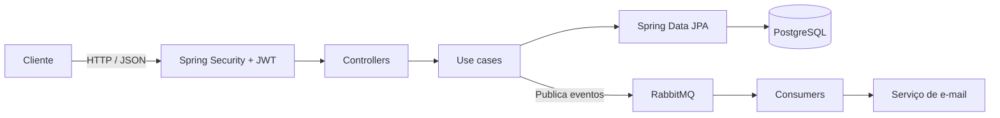
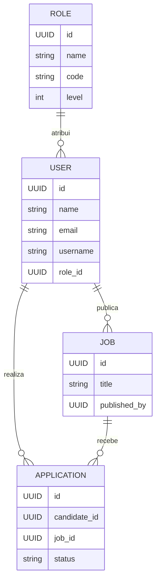

# OpenJobs

> 🚧 API em desenvolvimento. As funcionalidades e os contratos podem evoluir.

O **OpenJobs** é uma API REST para uma plataforma de vagas. O projeto foi construído para praticar desenvolvimento backend com Java e Spring Boot, aplicando separação de responsabilidades, autenticação, persistência relacional, validação, mensageria e testes automatizados.

## Visão geral

Atualmente, a API possui fundamentos para:

- Cadastro e autenticação de usuários com JWT.
- Criação e atualização de roles.
- Criação de vagas por usuários autenticados.
- Persistência com PostgreSQL e versionamento de schema via Flyway.
- Envio assíncrono de e-mails via RabbitMQ.
- Documentação interativa com OpenAPI/Swagger.
- Testes unitários e verificação contínua com GitHub Actions.

## Tecnologias

- Java 17 e Spring Boot 4
- Spring Web MVC, Spring Data JPA e Hibernate
- Spring Security e JSON Web Token (JWT)
- PostgreSQL e Flyway
- RabbitMQ e Spring AMQP
- Redis para o ambiente local
- Jakarta Validation, Lombok e SpringDoc OpenAPI
- Maven, Docker Compose e GitHub Actions

## Arquitetura

O código é organizado por domínio. Cada módulo reúne controller, entidade, repositório e casos de uso relacionados, enquanto os casos de uso concentram as regras de negócio.



```text
src/main/java/com/antony/openjobs/
├── common/             # Respostas e estruturas compartilhadas
├── config/             # Segurança, JWT, mensageria e configurações
├── messaging/          # Filas e consumidores
├── modules/
│   ├── auth/           # Sign-up e sign-in
│   ├── users/          # Usuários
│   ├── roles/          # Roles e regras de autorização
│   ├── jobs/           # Vagas
│   └── applications/   # Candidaturas
├── services/           # Serviços de e-mail e fila
└── utils/              # Tratamento global de erros e utilitários
```

## Modelo de dados

As migrations do Flyway criam as entidades principais: `users`, `roles`, `jobs` e `applications`.



## Executando localmente

### Pré-requisitos

- JDK 17+
- Docker e Docker Compose

### 1. Configure as variáveis de ambiente

Crie seu arquivo `.env` a partir do exemplo:

```powershell
Copy-Item .env.example .env
```

Atualize as credenciais e chaves no `.env`. Nunca versione esse arquivo.

### 2. Inicie as dependências

```powershell
docker compose up -d
```

O Compose disponibiliza PostgreSQL, RabbitMQ e Redis. O RabbitMQ Management fica disponível em `http://localhost:15672`.

### 3. Inicie a API

No Windows:

```powershell
.\mvnw.cmd spring-boot:run
```

No Linux ou macOS:

```bash
./mvnw spring-boot:run
```

As migrations são executadas automaticamente na inicialização.

## Documentação da API

Com a aplicação em execução, abra o Swagger UI:

```text
http://localhost:8080/swagger-ui/index.html
```

## Testes e build

Execute toda a suíte de testes:

```powershell
.\mvnw.cmd test
```

Para compilar, testar e verificar o projeto como no pipeline de CI:

```powershell
.\mvnw.cmd verify
```

O GitHub Actions executa `verify` em pushes e pull requests direcionados à branch `main`.
