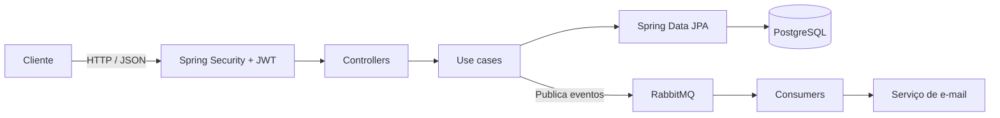
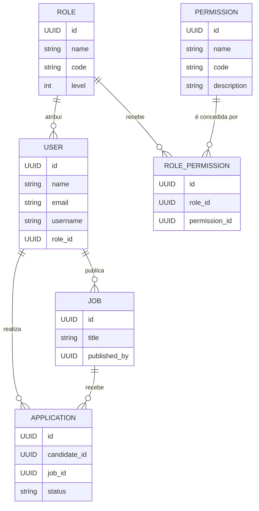

# OpenJobs

> 🚧 API em desenvolvimento. As funcionalidades e os contratos podem evoluir.

O **OpenJobs** é uma API REST para uma plataforma de vagas. O projeto foi construído para praticar desenvolvimento backend com Java e Spring Boot, aplicando separação de responsabilidades, autenticação, persistência relacional, validação, mensageria e testes automatizados.

## Visão geral

Atualmente, a API possui fundamentos para:

- Cadastro e autenticação de usuários com JWT contendo os IDs do usuário e da role.
- Gerenciamento de usuários e roles.
- Criação, listagem, atualização e exclusão de vagas, além de candidaturas.
- Autorização por permissões vinculadas a roles nas rotas de vagas.
- Persistência com PostgreSQL e versionamento de schema via Flyway.
- Envio assíncrono de e-mails via RabbitMQ.
- Documentação interativa com OpenAPI/Swagger.
- Testes unitários e verificação contínua com GitHub Actions.

## Tecnologias

- Java 17 e Spring Boot 4
- Spring Web MVC, Spring Data JPA e Hibernate
- Spring Security e JSON Web Token (JWT)
- PostgreSQL e Flyway
- RabbitMQ e Spring AMQP
- Redis para o ambiente local
- Jakarta Validation, Lombok e SpringDoc OpenAPI
- Maven, Docker Compose e GitHub Actions

## Arquitetura

O código é organizado por domínio. Cada módulo reúne controller, entidade, repositório e casos de uso relacionados, enquanto os casos de uso concentram as regras de negócio.



```text
src/main/java/com/antony/openjobs/
├── common/             # Respostas e estruturas compartilhadas
├── config/             # Segurança, JWT, mensageria e configurações
├── messaging/          # Filas e consumidores
├── modules/
│   ├── auth/           # Sign-up e sign-in
│   ├── users/          # Usuários
│   ├── roles/          # Roles
│   ├── permissions/    # Catálogo de permissões
│   ├── rolepermissions/ # Vínculos entre roles e permissões
│   ├── jobs/           # Vagas
│   └── applications/   # Candidaturas
├── services/           # Serviços de e-mail e fila
└── utils/              # Tratamento global de erros e utilitários
```

## Modelo de dados

As migrations do Flyway criam as tabelas `users`, `roles`, `permissions`, `role_permissions`, `jobs` e `applications`.



## Autenticação e permissões

No login e no cadastro, a API emite um JWT com `userId` no *subject* e `roleId` em um *claim*. O filtro JWT valida o token e disponibiliza esses IDs no `AuthenticatedUser` da requisição.

Para proteger um método do controller, use uma constante do enum `Permission`:

```java
@RequiresPermission(Permission.JOB_CREATE)
@PostMapping
public ResponseEntity<?> create(...) {
    // ...
}
```

O Spring intercepta métodos com `@RequiresPermission` antes de executá-los. O verificador lê o código da constante (`JOB_CREATE`, no exemplo) e consulta `role_permissions` para saber se a role do token está vinculada a uma permissão ativa com esse código. Sem o vínculo, a API responde `403 Forbidden` com a mensagem `Você não tem permissão para esta ação`.

Hoje, `@RequiresPermission` está aplicada às quatro operações de `/v1/jobs`. Os demais códigos já existem no enum e podem ser usados nos respectivos controllers.

| Código | Operação |
| --- | --- |
| `USER_READ` | Listar usuários |
| `USER_UPDATE` | Atualizar dados e role de um usuário |
| `USER_DELETE` | Desativar um usuário |
| `ROLE_READ` | Listar roles |
| `ROLE_CREATE` | Criar uma role |
| `ROLE_UPDATE` | Atualizar nome, código e nível de uma role |
| `JOB_READ` | Listar vagas |
| `JOB_CREATE` | Publicar uma vaga |
| `JOB_UPDATE` | Atualizar uma vaga publicada pelo próprio usuário |
| `JOB_DELETE` | Excluir uma vaga publicada pelo próprio usuário |
| `APPLICATION_READ` | Listar as próprias candidaturas |
| `APPLICATION_CREATE` | Candidatar-se a uma vaga |
| `APPLICATION_DELETE` | Retirar uma candidatura própria |

A migration V8 cria as tabelas, mas não cadastra permissões nem as atribui a roles. Em um banco novo, cadastre as permissões com `code` igual ao valor do enum e crie os vínculos em `role_permissions`. A role `founder` do banco local recebeu os 13 vínculos diretamente no PostgreSQL; esse dado não é recriado pelas migrations.

Como `roleId` fica no JWT, uma mudança de role do usuário exige novo login. Mudanças nos vínculos de permissão da mesma role passam a valer na próxima requisição.

## Executando localmente

### Pré-requisitos

- JDK 17+
- Docker e Docker Compose

### 1. Configure as variáveis de ambiente

Crie seu arquivo `.env` a partir do exemplo:

```powershell
Copy-Item .env.example .env
```

Atualize as credenciais e chaves no `.env`. Nunca versione esse arquivo.

### 2. Inicie as dependências

```powershell
docker compose up -d
```

O Compose disponibiliza PostgreSQL, RabbitMQ e Redis. O RabbitMQ Management fica disponível em `http://localhost:15672`.

### 3. Inicie a API

No Windows:

```powershell
.\mvnw.cmd spring-boot:run
```

No Linux ou macOS:

```bash
./mvnw spring-boot:run
```

As migrations são executadas automaticamente na inicialização.

## Documentação da API

Com a aplicação em execução, abra o Swagger UI:

```text
http://localhost:8080/swagger-ui/index.html
```

## Testes e build

Execute toda a suíte de testes:

```powershell
.\mvnw.cmd test
```

Para compilar, testar e verificar o projeto como no pipeline de CI:

```powershell
.\mvnw.cmd verify
```

O GitHub Actions executa `verify` em pushes e pull requests direcionados à branch `main`.
